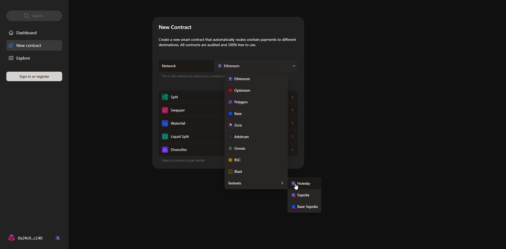
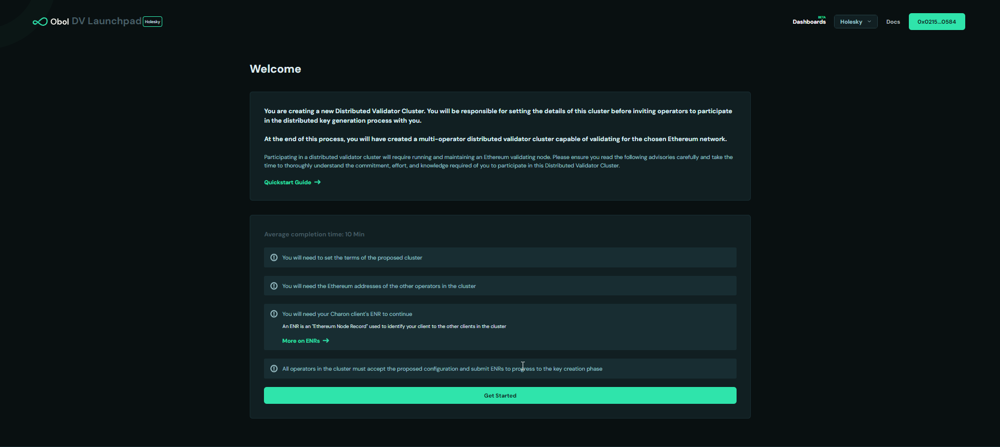

# Walkthough: Deploy a CSM DV with Linux CLI

To start, this guide makes a couple assumptions:

1.  You're running on a Linux distribution and you've installed Git and Docker. 
2.  You'll be delpoying on mainnet. Some screenshots in this guide are from Holesky just for demonstration purposes, so please verify you are on a mainnet addresses.

## Getting started

This guide will be broken down into 3 parts:

Part 1: Create cluster multi-sig + 0xSplits contract

Part 2: Use Obol Launchpad + CLI to create the cluster

Part 3: Deploy the validator to CSM 


In this guide we'll be using CSM with `extendedManagerPermissions` where the `managerAddress` is set to the cluster multi-sig and the `rewardAddress` is set to the 0xSplits contract. 


## Part 1: Creating the Cluster multi-sig + 0xSplits Contract

Detailed instructions on how to create a Safe Wallet can be found [here](https://help.safe.global/en/articles/40868-creating-a-safe-on-a-web-browser). 

Squad leader should obtain the signer addresses from all the cluster members, then connect their signer wallet and create a new Safe. 


After giving the Safe a name and selecting the appropriate network, continue by clicking the `Next` button.


Add all the signer addresses of the cluster members, select a threshold, and proceed to the final step by clicking the `Next` button.


Finally, submit the transaction to create the Safe by clicking on the `Create` button.


## Creating the reward split contract

Squad leader should obtain the reward addresses from all the cluster members. Open https://app.splits.org and create a `new contract`. Make sure to select the appropriate network. 



Select `Split` for the contract type.


Add the reward addresses of all cluster members. Choose whether the contract is immutable (recommended option), whether to sponsor the maintainers of [splits.org](https://splits.org), and whether there is a distribution bounty so that third parties can distribute the rewards in exchange for a small fee.


Finally, click the `Create Split` button, execute the transaction and share the created split contract with all cluster members for review.


## Part 2: Use Obol Launchpad + CLI to create the cluster

`Charon` is the middleware client that enables validators to be run by a group of independent node operators - a cluster or squad. A complete multi-container `Docker` setup including execution client, consensus client, validator client, MEV-Boost, the `Charon` client and monitoring tools can be found in this repository https://github.com/ObolNetwork/charon-distributed-validator-node. 


### Step 1: Clone the repo and add give $USER permissions

```sh
git clone https://github.com/ObolNetwork/charon-distributed-validator-node.git
```

```sh
sudo usermod -a -G docker $USER
```

If you're logged in via ssh, restart your session. 


### Step 2: Create ENR and Backup your Private Key

Enter the CDVN directory:

```sh
cd charon-distributed-validator-node
```

Use docker to create an ENR

```sh
docker run --rm -v "$(pwd):/opt/charon" obolnetwork/charon:v1.1.1 create enr
```

### Back up the private key located in `.charon/charon-enr-private-key`


### Step 3: Create the DV cluster configuration using the Launchpad

Obol has inegrated a CSM configuration into the launchpad. Choosing this configuration allows you to create up to 12 validator keys (CSM EA Limit) with Lido's required withdrawal and fee recipient addresses.

To start, the squad leader opens the [DV Launchpad](https://launchpad.obol.org), then connects their wallet and chooses `Create a cluster with a group`.


Then click `Get Started`.



Accept all the necessary advisories and sign to confirm.


Cluster configuration begins here. First, select the cluster name and size, then enter all cluster members signer addresses.


- Select the number of validators (up to 12 for CSM EA) to deploy. 
- Enter the complete Public ENR which was generated during step 2 above.
- In the `Withdrawal Configuration` field, select `LIDO CSM`. This will automatically fill the required Withdrawal Address and Fee Recipient Addresss per [Lido Documentation](https://operatorportal.lido.fi/modules/community-staking-module#block-d8e94f551b2e47029a54e6cedea914a7).
- Finally, click on the `Create cluster configuration` button.


Lastly, share the cluster configuration link with the other cluster members.


### Step 4: Distributed Key Generation (DKG)

All squad members need to open the cluster invite link, connect their wallet, accept all necessary advisories, and verify the cluster configuration with a signature. Each squad member will need to input their ENR, so see steps 1 and 2 above.


Once all members confirm the configuration they will see the `continue` button.


On the next page, they will find a CLI command which is used to begin the Distributed Key Generation (DKG).


All members need to synchronously complete this step. Go back to the terminal and make sure you're in the `charon-distributed-validator-node` directory:

```sh
pwd
```

If you are not, navigate to it using the `cd` command.
Paste the DKG command into your terminal and wait for all the other squad members to connect and complete the DKG ceremony.


New files were generated:  `cluster-lock.json`, `deposit-data.json`, `validator_keys` are all found in the  `.charon` folder (hidden by default). This contains each operator's partial key signatures for the validators.

**At this point, each operator must make a backup of the `.charon` folder and keep it safe, as validator keys can't be recreated.**


### Step 5: Edit `.env` file for Mainnet Adjustments

Copy and rename the .env.sample.mainnet file to .env

```sh
cp -n .env.sample.holesky .env
```

Open the `.env` file using you favourite editor:

```sh
sudo nano .env
```

Uncomment and set `BUILDER_API_ENABLED=true`.

Uncomment `MEVBOOST_RELAYS=` and set it to the URL of at least one of Lido's approved MEV relays [here](https://enchanted-direction-844.notion.site/6d369eb33f664487800b0dedfe32171e?v=8e5d1f1276b0493caea8a2aa1517ed65). Multiple relays must be separated by a comma. 


### Step 6: Starting the Node

Each cluster member should start the node with the following command:

```sh
docker compose up -d
```

At this point, execution and consensus clients should start syncing. Charon and the validator client should start waiting for the consensus client to be synced and the validator to be activated. 


## Part 3: Deploy the keys to Lido CSM

CSM is launching with a whitelisted set of approved operators (Early Access). The squad member with EA should be the one to create the node through the CSM widget. 

EA member will head to [CSM Extended Mode](https://csm.testnet.fi/?mode=extended) and connect their wallet. Note the `mode=extended` parameter. This allows the Lido CSM reward address to be set to the split contract created earlier. 


EA member clicks on the `Create Node Operator` button...


- EA member pastes the contents of the `deposit-data.json` file into the `Upload deposit data` field. EA member should have enough ETH/stETH/wstETH to cover the bond.

- Expand the `Specify custom addresses` section...

- Set the `Reward Address` field to the `Split` contract address and the `Manager Address` field to the `Safe` wallet address. (These were created previously in part 1.)

- Verify that the `Extended` box is outlined. This ensures that the `Safe` address has the ability to change the reward address if necessary. 

- Check that the correct addresses are set and click the `Create Node Operator` button.


Sign the transaction. The cluster is ready for deposit from Lido CSM.
